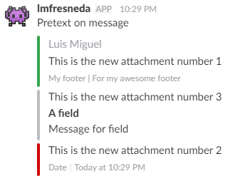
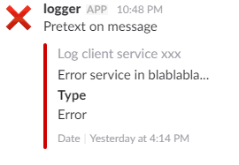

# SlackWhSend

Utility for send Slack Webhook messages in a simple way

## How to use

### npm

```bash
npm install --save slack-wh-send
```

```js
import SlackWhSend from 'slack-wh-send';

const slackWhSend = new SlackWhSend('https://hooks.slack.com/services/XXXXXXXXX/YYYYYYYYY/ZZZZZZZZZZZZZZZZZZZZZZZZ');
```

## Example

With this code:

```js
import SlackWhSend from 'slack-wh-send';

const slackWhSend = new SlackWhSend('https://hooks.slack.com/services/XXXXXXXXX/YYYYYYYYY/ZZZZZZZZZZZZZZZZZZZZZZZZ');

slackWhSend
  .init('Pretext on message')
  .username('lmfresneda')
  .channel('#random')
  .icon(':space_invader:')
  .newAttachment('This is the new attachment number 1')
    .color('good')
    .author('Luis Miguel')
    .footer('My footer')
    .footerValue('For my awesome footer')
  .newAttachment('This is the new attachment number 3')
    .color('#BDBDBD')
    .field('A field')
    .fieldMessage('Message for field')
  .newAttachment('This is the new attachment number 2')
    .color('danger')
    .defaultFooter()
  .send().then(function (res) {
    log('send ' + res);
  }).catch(console.error)
```

We generated this message in Slack:



Or we can use preformated attachments:

```js
import SlackWhSend from 'slack-wh-send';

const slackWhSend = new SlackWhSend('https://hooks.slack.com/services/XXXXXXXXX/YYYYYYYYY/ZZZZZZZZZZZZZZZZZZZZZZZZ');

const attachments = [
  {             
    "text": "Error service in blablabla...",  	      
    "color": "danger",             
    "author_name": "Log client service xxx",                        
    "fields": [                 
      {                     
        "title": "Type",                    
        "value": "Error",                     
        "short": true                 
      }             
    ],             
    "footer": "Date",             
    "ts": 1487430840
  }   
] 

slackWhSend
  .init('Pretext on message')
  .username('log_error')
  .channel('#errors')
  .icon(':space_invader:')
  .useAttachments(attachments) // use my attachments
  .send().then(function (res) {
      log('send ' + res);
    }).catch(console.error)
```

And we generated this message in Slack:


